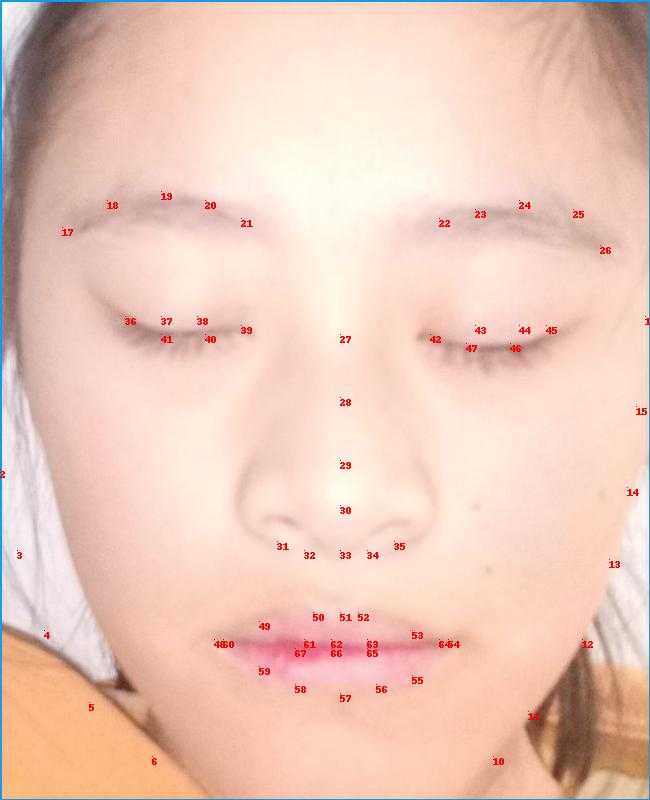

# Method
Based on [Face-Alignment](https://github.com/1adrianb/face-alignment "1adrianb / face-alignment").  
See more in [Face-Alignment](https://github.com/1adrianb/face-alignment "1adrianb / face-alignment") for details on using its model.

The output of each face contains of `68` landmarks of a human face, which will be explained later.

# Our Project
## Pre-processing pictures
To successfully detect landmarks, we adopt 2 simple methods. 

### Resize  
In our project, the model is fed with cropped face pictures by [MTCNN](https://github.com/AITTSMD/MTCNN-Tensorflow). (saved in `/data/yd_data/skin_qualitu/bounded_skin_data/imgs`)

Results of some faces are too big in size, and thus lead to failure in detection (experimental experiences). Others are too small, and also lead to failure.

Before feeding them into the model, we **check the size of each picture first.**  
Pictures whose height  `>= 800`, are resized to height of 800 and width with the same scale.

### Rotate
In our poject, face data come from selfies whose direction is vertical in general. But some pictures are not placed in the same direction, whose face is laid horizontally. These pictures will cause failure in landmark detection in some cases.

By comparing height and width, we select such pictures and rotate for 90 degree counterclockwise.

## Post-processing
~~Discussion needed on wheture save the pre-processed pictures or not~~

## Landmark results

68 landmark points.
|Part|Face Outline|Left Eyebrow| Right Eyebrow | Nose |Left Eye|Right Eye|Upper Lip|Lower Lip|
|---|:---:|:---:|:---:|:---:|:---:|:---:|:---:|:---:|  
|Index|0-16|17-21|22-26|27-35|36-41|42-47|48-54, 61-63|55-60, 64-67|

\* Note: Especially in face outline, chin or other parts may be cropped out during face cropping.

## Landmark save format
Results of landmark detection is saved in `/data/yd_data/skin-quality/landmarks/`  
Directory tree:  
`./txt/`  
`|| xxxxxxx.txt`  
`|| ...`    
`./rotate_list.txt`  
`./toosmall_list.txt`

### ./txt/
This is a directory where landmark results of each cropped image is given.

In each txt file, each row is a landmark's coordinates `(x,y)`. In usual, there are 68 rows. To load these data easily, numpy is available:

    preds = np.loadtxt('xxxxxxx.txt')

**NOTE!**  
However for those imgs that [Face-Alignment](https://github.com/1adrianb/face-alignment "1adrianb / face-alignment") fails to detect, only `NaN` is written in the txt file. Following codes may help to judge the situation.

    if preds.size==1:
        # detector fails to detect keypoints for this picture
        ...
    else:
        # landmarks given as a numpy array of size (68,2)
        ...
    
### rotate_list & toosmall_list
As mentioned earlier, rotation is applied under some circumstances. In case there are some wrongly rotated images, record of rotated imgs is listed in `rotate_list.txt`

And for those pictures whose size are too small (`max(width,height)<80 `), there will be error running the code for some reason. We simply decide the result is `NaN`. Record of such imgs is listed in `toosmall_list` 
