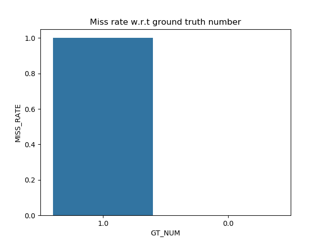
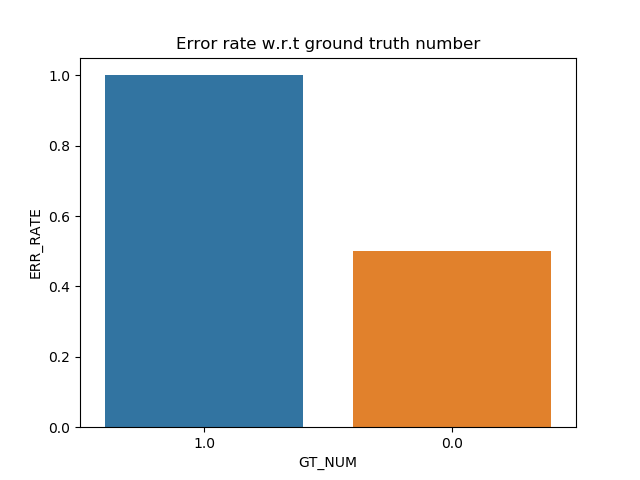
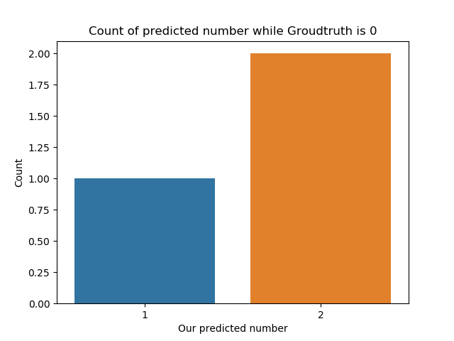

Evaluation tools for pimple, stain, black_head tasks

# Directory  Explanation
`label`: examples for groundtruth label  
`our_label`: examples for our predicted label

example results and pics are at root directory

# Example output
## MissRatePlot & ErrorRatePlot

## Plot for special situations
There are two special situations:  
1st. When ground truth suggests no object, we predicted some;  
2nd. When we predicted no object, ground truth suggests there is.  

For the former one, we counted the number of predicted objects. For the latter, number of groundtruth objects is counted.

## txt files
`EvalResult.txt`: contains average miss rate and error rate of different groundtruth number, as well as average on all images and average on all images except zero groundtruth.  
`CountOfPredictedNum_NoGT.txt`,`CountOfGroundtruthNum_NoPred.txt`: date of the above plot for special situation.
